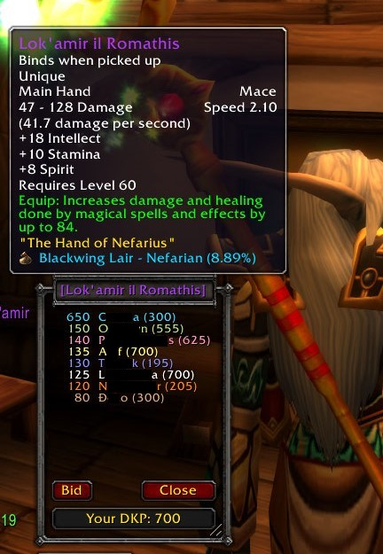

# DKP Bid View

This is an WoW Classic addon which shows you the status of a
[DKP](https://en.wikipedia.org/wiki/Dragon_kill_points) bidding currently taking
place in the raid chat. It lists all the current bidders participating ordered
by their current bid.

## Screenshots

## Usage

Bidding is tracked by certain pattern matchers who are monitoring the raid chat.
Once a pattern for "bid started" is found the window will pop up. On "bid accepted"
messages the bid window will update itself with the latest bid. And on "bid closed"
the window will disappear on its own.

## Alternative Future Approach

I've been thinking a better approach will be making the DKP bidding addons emit
certain messages directly to the DKP Bid View addon. A protocol for bidding information
of some sorts. This way the addon will not rely on chat parsing and everything can
be much more stable.

## TODO

[ ] Cancel button

[ ] Bid button

[ ] Showing the item for which the current bid is

[ ] Player names in class colors

[ ] Configure a wish list of items and ignore all else

[ ] Create release and upload addon zip on git tag with Github action
