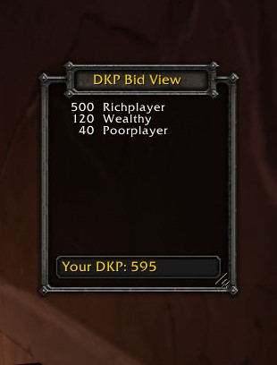

# DKP Bid View

This is an WoW Classic addon which shows you the status of a
[DKP](https://en.wikipedia.org/wiki/Dragon_kill_points) bidding currently taking
place in the raid chat. It lists all the current bidders participating ordered
by their current bid.

## Screenshots

## Usage

Bidding is tracked by certain pattern matchers who are monitoring the raid chat.

## TODO

[] Config screen
[] Cancel button
[] Bid button
[] Showing the item for which the current bid is
