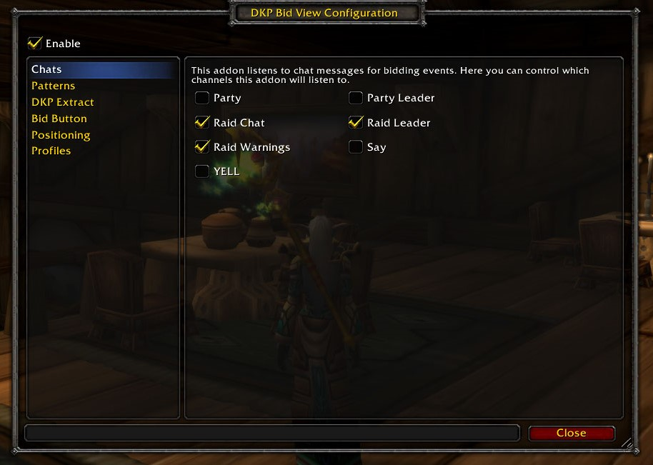

# DKP Bid View

This is an WoW Classic addon which shows you the status of a
[DKP](https://en.wikipedia.org/wiki/Dragon_kill_points) bidding currently taking
place in the raid chat. It lists all the current bidders participating ordered
by their current bid.

## Screenshots




## Usage

Bidding is tracked by certain pattern matchers who are monitoring the raid chat. The
addon listens to the chat and acts when certain messages are found. Once a pattern for
"bid started" is found the window will pop up. On "bid accepted" messages the bid
window will update itself with the latest bid. And on "bid closed" the window will
disappear on its own.

Obviously, for this to happen the addon expects certain message formats. The addon comes
with a certain message format built-in. Here it how it looks:

```
[LootMaster]: >>> Please no raid spam. Enter your bid for [OP Item]. Minimum BID is 10!
[BidderOne]: bid
[LootMaster]: BidderOne - Current bid: 10. OK!
[BidderTwo]: 20
[LootMaster]: BidderTwo - Current bid: 20. OK!
[StupidBidder]: 5
[LootMaster]: StupidBidder - NOT OK! Min bid = 25
[LootMaster]: BidderTwo won [OP Item] with 20 DKP.
```

The first message is opening of the bid. At this point the DKP Bid View will pop a
window open and show you that a bid is going on. The next messages are different bids
by players BidderOne, BidderTwo and StupidBidder. The addon will show an ordered
list of the valid bids only and ignore any noise. And the last message by LootMaster
closes the bid which causes the DKP Bid View window to disappear.

### Message Formats

The recognized message formats can be altered, though! This can be done via the addon's
configuration UI. It can be found under Interface Options -> AddOns -> DKP Bid View. Under
the patterns tab there are the different patterns for every type of message. They are
all Lua regular expressions which can be hard to change for someone unfamiliar with them,
though. I am thinking of a better way to create patterns.

### Bid Button

The addon comes with a Bid button. When bidding is open one can use it to bid for the current
item. It sends a chat message to /raid, /party or /say, depending the current status of the
player. The sent message can be controlled in the AddOns settings.

### My DKP Status

As the screenshots show the addon will try to display your character's current DKP. It
searches for it in the guild officers' notes. And there is a different patter for that
as well.

### Window Positioning

One can position the DKP without waiting for a DKP bidding to start by typing `/dkpbv show`.
Once the window is on the desired position it can be hidden with `/dkpbv hide`.

## Alternative Future Approach

I've been thinking a better approach will be making the DKP bidding addons emit
certain messages directly to the DKP Bid View addon. A protocol for bidding information
of some sorts. This way the addon will not rely on chat parsing and everything can
be much more stable.

## TODO

[ ] Indicate when the player is winning the bid

[ ] Player names in class colors

[ ] Configure a wish list of items and ignore all else

